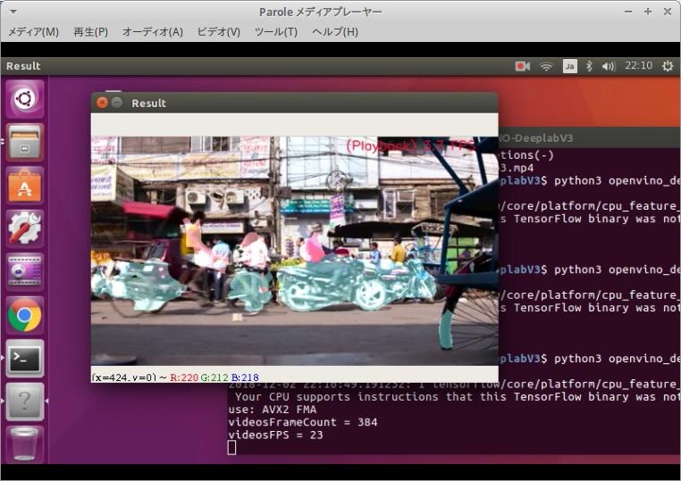
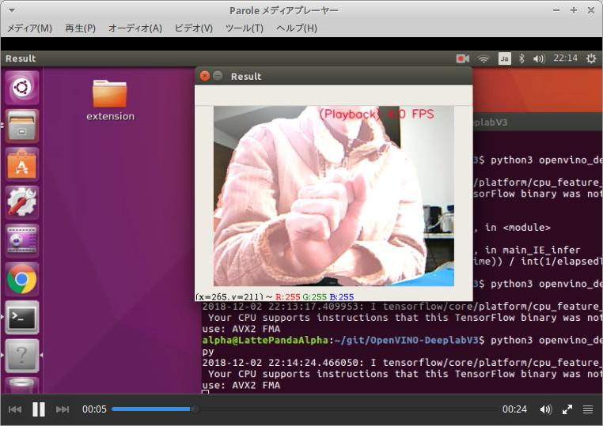
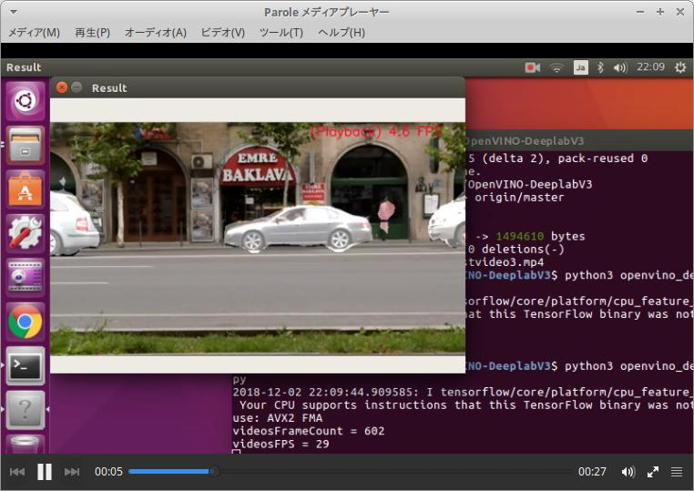

# OpenVINO-DeeplabV3
[5 FPS / CPU only] OpenVINO+DeeplabV3+LattePandaAlpha. CPU / GPU / NCS. RealTime semantic-segmentaion.   Python3.5+OpenCV3.4.3+PIL  
  
**【Japanese article】[Real-time Semantic Segmentation with CPU alone [part2] [4-5 FPS / CPU only] DeeplabV3+MobilenetV2](https://qiita.com/PINTO/items/15d822c3d280c42e08c8)**
  
**【Result 1】Click the image below to play Youtube video. (CPU only mode. 4.0FPS - 5.0FPS)**  
  
**【Result 2】Click the image below to play Youtube video. (CPU only mode. 4.0FPS - 5.0FPS)**  
  
**【Result 3】Click the image below to play Youtube video. (CPU only mode. 4.0FPS - 5.0FPS)**  
  
# Environment
- LattePanda Alpha (Intel 7th Core m3-7y30)
- Ubuntu 16.04 x86_64
- OpenVINO toolkit 2018 R4 (2018.4.420)
- Python 3.5
- OpenCV 3.4.3
- PIL
- DeeplabV3 + MobilenetV2 (Pascal VOC 2012)

# Reference article, thanks
https://github.com/FionaZZ92/OpenVINO.git  
https://medium.com/@oleksandrsavsunenko/optimizing-neural-networks-for-production-with-intels-openvino-a7ee3a6883d  
