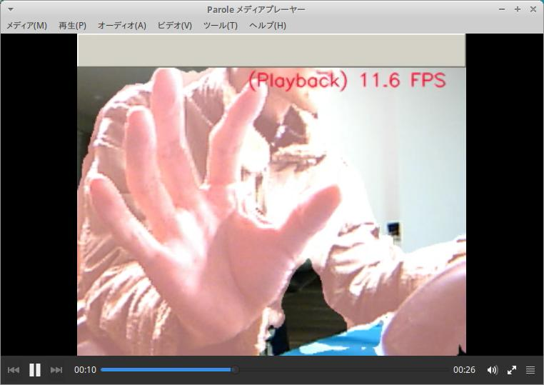
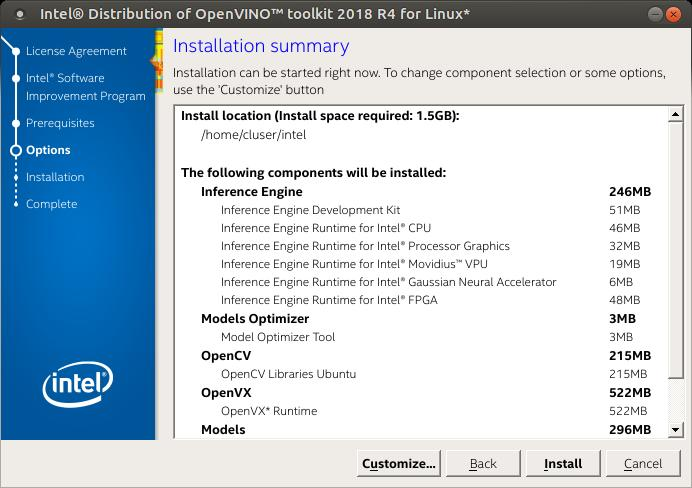
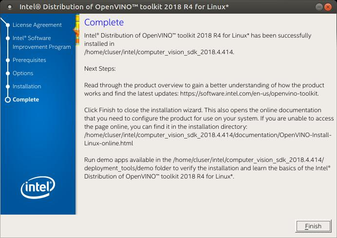

# OpenVINO-DeeplabV3
[4-5 FPS / Core m3 CPU only] [11 FPS / Core i7 CPU only]  
OpenVINO+DeeplabV3+LattePandaAlpha. CPU / GPU / NCS. RealTime semantic-segmentaion.   Python3.5+OpenCV3.4.3+PIL  
  
**【Japanese article / English article】**  
**[（１） Introducing Ubuntu 16.04 + OpenVINO to Latte Panda Alpha 864 (without OS included) and enjoying Semantic Segmentation with Neural Compute Stick and Neural Compute Stick 2](https://qiita.com/PINTO/items/5ac8f4395e190d06cfab#introducing-ubuntu-1604--openvino-to-latte-panda-alpha-864-without-os-included-and-enjoying-semantic-segmentation-with-neural-compute-stick-and-neural-compute-stick-2)**  
  
**[（２） Real-time Semantic Segmentation with CPU alone [part2] [4-5 FPS / Core m3 CPU only] [11-12 FPS / Core i7 CPU only] DeeplabV3+MobilenetV2](https://qiita.com/PINTO/items/15d822c3d280c42e08c8)**
  
  
# Results
**【Result 1】 Click the image below to play Youtube video. (Core m3 + CPU only mode. 4.0FPS - 5.0FPS)**  
[](https://youtu.be/CxxDwK7vBAo)  
  
**【Result 2】 Click the image below to play Youtube video. (Core m3 + CPU only mode. 4.0FPS - 5.0FPS)**  
[](https://youtu.be/-pXB3dDj-rQ)  
  
**【Result 3】 Click the image below to play Youtube video. (Core m3 + CPU only mode. 4.0FPS - 5.0FPS)**  
[](https://youtu.be/1NLCr5XnVX8)  

**【Result 4】 Click the image below to play Youtube video. (Core i7 + CPU only mode. 11.0FPS - 12.0FPS)**  
[](https://youtu.be/TjiH2dMltl4)  
  
# Environment
- LattePanda Alpha (Intel 7th Core m3-7y30) or LaptopPC (Intel 8th Core i7-8750H)
- Ubuntu 16.04 x86_64
- OpenVINO toolkit 2018 R4 (2018.4.420)
- Python 3.5
- OpenCV 3.4.3
- PIL
- Tensorflow v1.11.0 or Tensorflow-GPU v1.11.0 (pip install)
- DeeplabV3 + MobilenetV2 (Pascal VOC 2012)
- USB Camera (PlaystationEye) / Movie file (mp4)
- 【option】 Intel Neural Compute Stick / Intel Neural Compute Stick 2 or GPU

# Benchmark
**https://ncsforum.movidius.com/discussion/1329/lattepanda-alpha-openvino-cpu-core-m3-vs-ncs1-vs-ncs2-performance-comparison**

# Usage
### 1. Installation of OpenVINO main unit
#### 1.1 Download
```bash
$ cd ~/Downloads
$ curl -sc /tmp/cookie "https://drive.google.com/uc?export=download&id=18-TeUzeN34CV-QqM0rO3wpdEGODTWrBc" > /dev/null
$ CODE="$(awk '/_warning_/ {print $NF}' /tmp/cookie)"
$ curl -Lb /tmp/cookie "https://drive.google.com/uc?export=download&confirm=${CODE}&id=18-TeUzeN34CV-QqM0rO3wpdEGODTWrBc" -o l_openvino_toolkit_p_2018.4.420.tgz
$ tar -zxf l_openvino_toolkit_p_2018.4.420.tgz
$ cd l_openvino_toolkit_p_2018.4.420
```
#### 1.2 Install basic functions
```bash
## GUI version installer
$ sudo ./install_GUI.sh
or
## CUI version installer
$ sudo ./install.sh
```




```bash
$ cd /opt/intel/computer_vision_sdk/install_dependencies
$ sudo -E ./install_cv_sdk_dependencies.sh
$ nano ~/.bashrc
source /opt/intel/computer_vision_sdk/bin/setupvars.sh

$ source ~/.bashrc
$ cd /opt/intel/computer_vision_sdk/deployment_tools/model_optimizer/install_prerequisites
$ sudo ./install_prerequisites.sh
```
#### 1.3 Install optional features
##### 1.3.1 【Optional execution】 Additional installation steps for the Intel® Movidius™ Neural Compute Stick v1 and Intel® Neural Compute Stick v2
```bash
$ sudo usermod -a -G users "$(whoami)"
$ cat <<EOF > 97-usbboot.rules
SUBSYSTEM=="usb", ATTRS{idProduct}=="2150", ATTRS{idVendor}=="03e7", GROUP="users", MODE="0666", ENV{ID_MM_DEVICE_IGNORE}="1"
SUBSYSTEM=="usb", ATTRS{idProduct}=="2485", ATTRS{idVendor}=="03e7", GROUP="users", MODE="0666", ENV{ID_MM_DEVICE_IGNORE}="1"
SUBSYSTEM=="usb", ATTRS{idProduct}=="f63b", ATTRS{idVendor}=="03e7", GROUP="users", MODE="0666", ENV{ID_MM_DEVICE_IGNORE}="1"
EOF

$ sudo cp 97-usbboot.rules /etc/udev/rules.d/
$ sudo udevadm control --reload-rules
$ sudo udevadm trigger
$ cd /opt/intel/common/mdf/lib64
$ sudo mv igfxcmrt64.so igfxcmrt64.so.org
$ sudo ln -s libigfxcmrt64.so igfxcmrt64.so
$ cd /opt/intel/mediasdk/lib64
$ sudo mv libmfxhw64.so.1 libmfxhw64.so.1.org
$ sudo mv libmfx.so.1 libmfx.so.1.org
$ sudo mv libva-glx.so.2 libva-glx.so.2.org
$ sudo mv libva.so.2 libva.so.2.org
$ sudo mv libigdgmm.so.1 libigdgmm.so.1.org
$ sudo mv libva-drm.so.2 libva-drm.so.2.org
$ sudo mv libva-x11.so.2 libva-x11.so.2.org
$ sudo ln -s libmfxhw64.so.1.28 libmfxhw64.so.1
$ sudo ln -s libmfx.so.1.28 libmfx.so.1
$ sudo ln -s libva-glx.so.2.300.0 libva-glx.so.2
$ sudo ln -s libva.so.2.300.0 libva.so.2
$ sudo ln -s libigdgmm.so.1.0.0 libigdgmm.so.1
$ sudo ln -s libva-drm.so.2.300.0 libva-drm.so.2
$ sudo ln -s libva-x11.so.2.300.0 libva-x11.so.2
$ sudo ldconfig
$ rm 97-usbboot.rules
```
##### 1.3.2 【Optional execution】 Additional installation steps for processor graphics (GPU)
```bash
$ cd /opt/intel/computer_vision_sdk/install_dependencies/
$ sudo -E su
$ uname -r
4.15.0-42-generic #<--- display kernel version sample

### Execute only when the kernel version is older than 4.14
$ ./install_4_14_kernel.sh

$ ./install_NEO_OCL_driver.sh
$ sudo reboot
```

### 2. Downgrade to stable OpenCV
Since OpenCV 4.0.0-pre introduced by default had bug in Gstreamer and it did not work properly, we will reinstall OpenCV 3.4.3 on our own.
```bash
$ sudo -H pip3 install opencv-python==3.4.3.18
$ nano ~/.bashrc
export PYTHONPATH=/usr/local/lib/python3.5/dist-packages/cv2:$PYTHONPATH

$ source ~/.bashrc
```
### 3. Upgrade to Tensorflow v1.11.0
Upgrade to old version Tensorflow v1.9.0, introduced by default, to Tensorflow v1.11.0, as subsequent model optimizer processing will fail.
```bash
$ sudo -H pip3 install pip --upgrade

$ python3 -c 'import tensorflow as tf; print(tf.__version__)'
1.9.0 #<--- display Tensorflow version sample

$ sudo -H pip3 install tensorflow==1.11.0 --upgrade
or
$ sudo -H pip3 install tensorflow-gpu==1.11.0 --upgrade
```
### 4. Settings for offloading custom layer behavior to Tensorflow
```bash
$ sudo apt-get install -y git pkg-config zip g++ zlib1g-dev unzip
$ cd ~
$ wget https://github.com/bazelbuild/bazel/releases/download/0.18.1/bazel-0.18.1-installer-linux-x86_64.sh
$ sudo chmod +x bazel-0.18.1-installer-linux-x86_64.sh
$ ./bazel-0.18.1-installer-linux-x86_64.sh --user
$ echo 'export PATH=$PATH:$HOME/bin' >> ~/.bashrc
$ source ~/.bashrc
$ cd /opt
$ sudo git clone -b v1.11.0 https://github.com/tensorflow/tensorflow.git
$ cd tensorflow
$ sudo git checkout -b v1.11.0
$ echo 'export TF_ROOT_DIR=/opt/tensorflow' >> ~/.bashrc
$ source ~/.bashrc
$ sudo nano /opt/intel/computer_vision_sdk/bin/setupvars.sh

#Before
INSTALLDIR=/opt/intel//computer_vision_sdk_2018.4.420
↓
#After
INSTALLDIR=/opt/intel/computer_vision_sdk_2018.4.420

$ source /opt/intel/computer_vision_sdk/bin/setupvars.sh
$ sudo nano /opt/intel/computer_vision_sdk/deployment_tools/model_optimizer/tf_call_ie_layer/build.sh

#Before
bazel build --config=monolithic //tensorflow/cc/inference_engine_layer:libtensorflow_call_layer.so
↓
#After
sudo -H $HOME/bin/bazel build --config monolithic //tensorflow/cc/inference_engine_layer:libtensorflow_call_layer.so
or
sudo -H $HOME/bin/bazel --host_jvm_args=-Xmx512m build --config monolithic --local_resources 1024.0,0.5,0.5 //tensorflow/cc/inference_engine_layer:libtensorflow_call_layer.so

$ sudo -E /opt/intel/computer_vision_sdk/deployment_tools/model_optimizer/tf_call_ie_layer/build.sh

$ su -
$ cp /opt/tensorflow/bazel-bin/tensorflow/cc/inference_engine_layer/libtensorflow_call_layer.so /usr/local/lib
$ exit
$ nano ~/.bashrc
export PYTHONPATH=$PYTHONPATH:/usr/local/lib

$ source ~/.bashrc
$ sudo ldconfig
```
### 5. 【Optional execution】 Build sample programs and CPU extension
```bash
$ cd /opt/intel/computer_vision_sdk/deployment_tools/inference_engine/samples
$ sudo ./build_samples.sh

### The prebuilt binary is saved in the following path
### ~/inference_engine_samples_build/intel64/Release/
```
### 6. 【Optional execution】【Example】 Conversion of Tensorflow-DeeplabV3 model to lr format
#### 6-1. Pascal VOC
```bash
$ cd ~
$ mkdir model
$ wget http://download.tensorflow.org/models/deeplabv3_mnv2_pascal_train_aug_2018_01_29.tar.gz
$ tar -zxvf deeplabv3_mnv2_pascal_train_aug_2018_01_29.tar.gz
$ cp deeplabv3_mnv2_pascal_train_aug/frozen_inference_graph.pb model
$ sudo python3 /opt/intel/computer_vision_sdk/deployment_tools/model_optimizermo_tf.py \
--input_model model/inference_frozen_graph.pb \
--input 0:MobilenetV2/Conv/Conv2D \
--output ArgMax \
--input_shape [1,513,513,3] \
--output_dir model
```
#### 6-2. MS-COCO cityscapes
```bash
$ wget http://download.tensorflow.org/models/deeplabv3_mnv2_cityscapes_train_2018_02_05.tar.gz
$ tar -zxvf deeplabv3_mnv2_cityscapes_train_2018_02_05.tar.gz
```

### 7. Execution (The default is "USB Camera mode")
```bash
$ cd ~
$ git clone https://github.com/PINTO0309/OpenVINO-DeeplabV3.git
$ cd OpenVINO-DeeplabV3
$ python3 openvino_deeplabv3_test.py
```

# Reference article, thanks
https://github.com/FionaZZ92/OpenVINO.git  
https://medium.com/@oleksandrsavsunenko/optimizing-neural-networks-for-production-with-intels-openvino-a7ee3a6883d  
https://github.com/tensorflow/models/blob/master/research/deeplab/g3doc/model_zoo.md  
https://blogs.yahoo.co.jp/verification_engineer/71450155.html  
